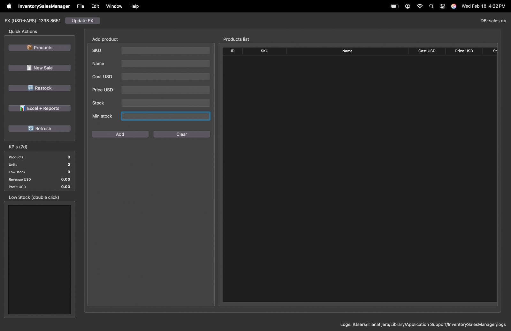

# Inventory & Sales Manager (ISM)

A professional desktop application for inventory, sales, and restock management built with Python, Tkinter, and SQLite.

This project implements a clean layered architecture with proper separation of concerns between domain logic, services, repositories, and UI. It is designed to demonstrate production-ready structure, financial correctness, and maintainability.

---

## Screenshot


---

## Overview

Inventory & Sales Manager (ISM) is a desktop system that allows small businesses or individuals to:

- Manage product inventory
- Register sales with automatic stock deduction
- Track restock operations with weighted cost recalculation
- Convert USD to ARS using live exchange rates
- Import products from Excel
- Export professional Excel reports
- Monitor KPIs and profit performance

The system guarantees full traceability of stock movements and financial calculations.

---

## Architecture

The project follows a layered architecture to ensure maintainability and scalability.

```
inventory-sales-manager/
│
├── pyproject.toml
├── README.md
└── src/
    └── ism/
        │
        ├── main.py
        ├── config.py
        ├── logging_config.py
        │
        ├── domain/
        │   ├── models.py
        │   └── errors.py
        │
        ├── repositories/
        │   └── sqlite_repo.py
        │
        ├── services/
        │   ├── fx_service.py
        │   ├── inventory_service.py
        │   ├── sales_service.py
        │   ├── purchase_service.py
        │   ├── excel_service.py
        │   └── reporting_service.py
        │
        └── ui/
            ├── app.py
            └── views/
                ├── products_view.py
                ├── sales_view.py
                ├── restock_view.py
                └── reports_view.py
```

---

## Architecture Principles

### Domain Layer
- Contains business entities and domain rules
- No UI or database dependencies

### Repository Layer
- Handles SQLite persistence
- Encapsulates all SQL operations

### Service Layer
Implements business logic:
- Stock validation
- Weighted average cost
- Profit calculation
- FX handling
- Reporting aggregation
- Excel import/export coordination

### UI Layer
- Tkinter-based presentation layer
- No business logic
- All operations go through services

### Dependency Injection
- Services are wired in `main.py` and injected into the UI
- The UI never instantiates repositories directly

---

## Features

### Product Management
- SKU-based product identification
- Create and update products
- Minimum stock thresholds
- Low-stock highlighting
- Inventory overview panel

### Sales
- Cart-based sale workflow
- Automatic stock validation
- Automatic stock deduction
- USD → ARS conversion at time of sale
- Line-level profit calculation
- Detailed sale history
- 7-day KPI revenue and profit tracking

### Restock / Purchases
- Manual restock interface
- Vendor and notes tracking
- Purchase history tracking
- Automatic stock increase
- Weighted average cost recalculation

Weighted cost formula:

```
new_cost = (old_stock * old_cost + qty * unit_cost) / (old_stock + qty)
```

This guarantees accurate future profit margins.

---

## Excel Integration

### Import

Required headers:

```
sku | name | cost_usd | price_usd | stock | min_stock
```

Import behavior:
- Existing stock is never overwritten
- If Excel stock > current stock → restock is logged as purchase
- New products are created with stock logged as purchase
- Full audit trail maintained

### Export

Generated Excel workbook includes:

#### Summary Sheet
- Sales count
- Revenue (USD / ARS)
- Gross profit
- Total restock spending
- Net profit

#### Sales Detail Sheet
- Sale ID
- Product
- Quantity
- Unit price
- Unit cost
- Line revenue
- Line profit
- Margin %

#### Purchases Sheet
- Purchase ID
- Vendor
- Product
- Quantity
- Unit cost
- Line total

All sheets include financial formatting and structured tables.

---

## Database

SQLite with foreign keys enabled.

Tables:
- `products`
- `sales`
- `sale_items`
- `purchases`
- `purchase_items`
- `fx_rates`

Transactional integrity is enforced for both sales and purchases.

---

## 🛠 Installation

### 1. Create virtual environment

```bash
py -m venv .venv
```

### 2. Activate (PowerShell)

```powershell
.\.venv\Scripts\Activate.ps1
```

If blocked:

```powershell
Set-ExecutionPolicy -Scope CurrentUser -ExecutionPolicy RemoteSigned
```

### 3. Install project

From project root:

```bash
python -m pip install --upgrade pip
python -m pip install -e .
```

---

## Run Application

From project root:

```bash
python -m ism.main
```

If installed with entry point:

```bash
ism
```

---


### Security and Operations
- Role-based permission matrix per action (admin/seller/viewer).
- PIN hashing with PBKDF2-SHA256.
- Login protection with temporary lockout after repeated failed attempts.
- One-click local SQLite backup from the app sidebar.

## Key Design Goals

- Clean separation of concerns
- Service-oriented business logic
- Accurate financial computation
- Traceable stock movements
- Professional reporting output
- Production-ready structure

---

## Technical Stack

- Python 3.10+
- Tkinter
- SQLite
- requests
- openpyxl
- Structured logging

---

## Author

Lautaro Cuello  
Python Developer
